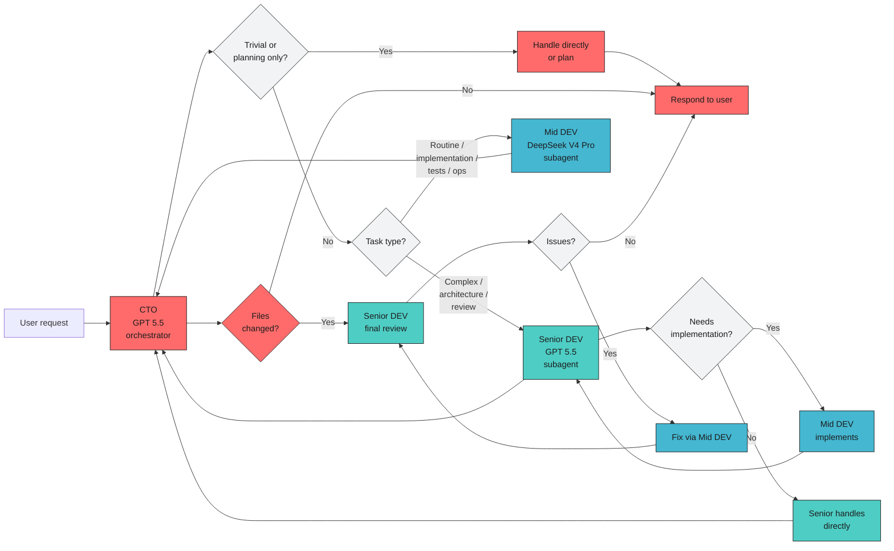

# OpenCode Workflow Diagram

Mermaid version of the 3-level company hierarchy workflow.

## Main Diagram

## Reading Guide

- User talks to **CTO**.
- **CTO** handles simple work directly, delegates everything else.
- Complex/architecture/review tasks go to **Senior DEV** (GPT 5.5).
- Routine implementation/tests/ops go to **Mid DEV** (DeepSeek V4 Pro).
- **Senior DEV** can delegate implementation subtasks to **Mid DEV**.
- All results flow back to **CTO** for final integration.

## Core Message

CTO (GPT 5.5) steers. Senior DEV (GPT 5.5) decides complex things. Mid DEV (DeepSeek V4 Pro) does the work. Expensive models used sparingly for high-value decisions.
