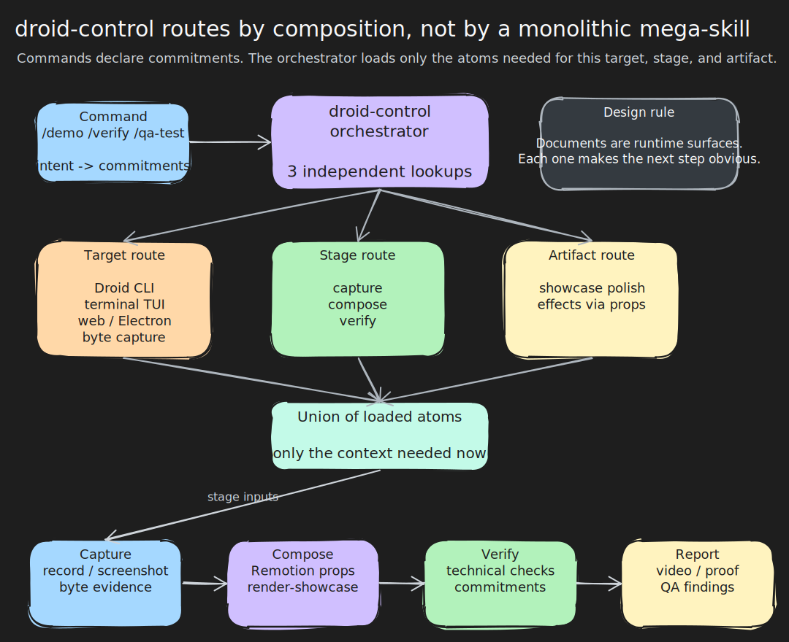
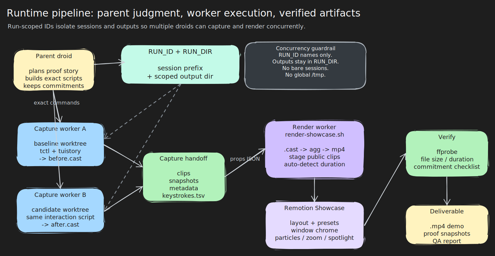

# droid-control architecture

`droid-control` is built around one constraint: the agent operating the tool is also the runtime. Architecture is therefore not just code organization. It is information architecture for a droid that must decide what to load, what to ignore, what to delegate, and what evidence proves the work.



Editable source: [`diagrams/architecture-routing.excalidraw`](diagrams/architecture-routing.excalidraw)

## What the architecture optimizes for

The plugin is designed to keep a droid focused while it operates real software:

- **Low context load:** load the Linux tuistory path without dragging in Windows KVM notes, macOS VM controls, browser automation, and Remotion internals.
- **Evidence-first workflows:** every command starts by making commitments, then ends by verifying the artifact against those commitments.
- **Parallel execution:** before/after captures and render jobs can run in worker droids without sharing session names or output paths.
- **Clear ownership:** commands decide *what* must be produced; atom skills decide *how* to execute their slice.
- **Platform specificity:** OS-specific mechanics live in platform subdocuments, not in global instructions.

## Commands are intent contracts

The three user-facing commands are deliberately thin:

| Command | Contract |
|---|---|
| `/demo` | Turn a PR or feature description into a visible proof story and a video deliverable. |
| `/verify` | Test a claim as an investigator and report whether the evidence confirms or refutes it. |
| `/qa-test` | Drive a terminal, browser, or Electron flow and report step-level pass/fail evidence. |

A command parses arguments into **commitments**: layout, comparison mode, evidence type, video/showcase requirements, keystroke overlays, and any user-specified constraints. Those commitments are not suggestions. The `verify` stage later checks them explicitly.

This is the first guardrail against agent drift. The droid does not start with "make something impressive." It starts with a checklist it must satisfy.

## Orchestrator: route, do not execute

`skills/droid-control/SKILL.md` is an orchestrator, not a controller. It does not run a state machine or encode every workflow. It performs three independent routing lookups and tells the droid which atom skills to load.

| Route | Question | Examples |
|---|---|---|
| **Target** | What are we driving? | Droid CLI, other terminal TUI, web/Electron app, raw PTY bytes |
| **Stage** | What does the workflow need? | capture, compose, verify |
| **Artifact** | Does compose need polish tools? | showcase presets, effects, keystroke overlays |

The routes compose without a cross-product explosion. Adding a new target means writing one target skill and one routing row; capture, compose, and verify can work with it immediately if the handoff shape is respected.

## Atom skills are runtime surfaces

Each atom skill is a self-contained surface the droid reads at a specific point in the workflow:

| Atom type | Skills | Responsibility |
|---|---|---|
| Driver atoms | `tuistory`, `true-input`, `agent-browser` | How to drive a class of environment. |
| Target atoms | `droid-cli`, `pty-capture` | Target-specific shortcuts, launch rules, and byte-capture patterns. |
| Stage atoms | `capture`, `compose`, `verify` | Lifecycle phases with explicit inputs and outputs. |
| Polish atom | `showcase` | Visual presets and cinematic layer guidance. |

The important property is not just smaller files. It is temporal relevance: the droid reads the capture rules while capturing, the compose rules while composing, and the verification rules when it has something to check.

## Waterfall by handoff, not framework

The workflow is a waterfall because each skill hands the next skill exactly what it needs:

```text
command commitments
  -> routed atom set
    -> capture outputs clips, screenshots, byte dumps, metadata
      -> compose outputs a rendered artifact and render metadata
        -> verify checks technical quality and original commitments
          -> report summarizes evidence and conclusion
```

No central engine enforces this order. The documents make the next step obvious enough that the droid follows the flow naturally. This keeps the system easy to extend: new behavior is usually a new atom or a new row, not a new orchestration framework.

## Hybrid handoffs

The compose handoff has two halves:

- **Mechanical fields:** layout, labels, clip paths, speed, fidelity, preset, output path, effects tier.
- **Creative intent:** what the viewer should understand, which moments matter, and how to frame the proof.

Mechanical fields prevent hallucinated parameters. Creative intent prevents paint-by-numbers output. The effects tier is the pattern in miniature: the command commits `none`, `utilitarian`, or `full`; compose chooses specific zooms, spotlights, and overlays only after it has real recordings to inspect.

## Delegation boundaries

The parent droid keeps judgment. Workers get exact commands.

| Work | Owner | Reason |
|---|---|---|
| Interpret PR / claim / QA goal | Parent | Requires context and judgment. |
| Write the interaction script | Parent | Defines the proof story. |
| Capture baseline and candidate branches | Worker droids | Independent, mechanical, parallelizable. |
| Render Remotion video | Worker droid | Mechanical once props and clips are fixed. |
| Verify commitments | Parent | Requires the original contract and evidence judgment. |

This boundary follows the stage handoffs. Capture workers need resolved `tctl` commands and worktree paths, not PR context. Render workers need a props JSON and clip paths, not a feature explanation.

## Runtime artifact pipeline



Editable source: [`diagrams/capture-compose-verify.excalidraw`](diagrams/capture-compose-verify.excalidraw)

Every workflow starts by creating a run scope:

```bash
RUN_ID="$(date +%s)-$$"
RUN_DIR="$(mktemp -d /tmp/droid-run-${RUN_ID}-XXXXXX)"
```

The run scope is not cosmetic. `tctl` sessions share `/tmp/tctl-sessions/`, and many droids may be filming on the same machine. Session names must be prefixed with `RUN_ID`; recordings, props, screenshots, and rendered videos must live under `RUN_DIR`.

## `tctl`: one terminal control boundary

Terminal workflows use `bin/tctl` as the only launch/control boundary. It hides two very different execution paths behind the same command shape:

| Backend | What `tctl` manages | Best for |
|---|---|---|
| `tuistory` | Virtual PTY sessions, deterministic waits/snapshots, asciinema recording at launch. | Fast TUI automation and most demo captures. |
| `true-input` | Headless Wayland compositor, real terminal emulator, native key injection, PTY log/screenshot/video capture. | Real terminal rendering or keyboard-encoding proof. |

`tctl` also enforces Droid CLI launch invariants. `droid-dev` sessions must provide `--repo-root`, which lets `tctl` set `DROID_DEV_REPO_ROOT` and record provenance for the captured branch and commit.

Browser and Electron workflows intentionally do **not** go through `tctl`; they use `agent-browser`, whose persistent Playwright-backed daemon is the right control boundary for DOM snapshots, screenshots, and CDP-connected apps.

## Video composition

The compose stage uses the Remotion project in `remotion/` as a single video engine. The droid writes a `Showcase` props JSON; `scripts/render-showcase.sh` handles the mechanical rendering pipeline:

1. Normalize props and choose fidelity.
2. Convert `.cast` recordings through `agg` and `ffmpeg`.
3. Stage clips into Remotion `public/`.
4. Auto-detect `clipDuration` with `ffprobe` when omitted.
5. Render the `Showcase` composition.
6. Clean staged clips and temporary conversion outputs.

This keeps droids out of the common failure modes: stale files in `public/`, mismatched `clipDuration`, wrong `agg` theme, invalid pixel formats, and hand-written Remotion commands with missing encode flags.

### Composition surface

The `Showcase` composition in `remotion/src/compositions/Showcase.tsx` is the only video entry point. Everything else lives in `remotion/src/components/` and is composed by props:

| Layer | Purpose | Controlled by |
|---|---|---|
| Background + FloatingParticles | Preset-driven warmth or coolness | `preset` |
| TitleCard / DroidOutro | Opening and closing cards (outro plays fanning rotor → crossfade → DROID wordmark) | `title`, `subtitle`, `speedNote` |
| Window chrome + layouts | `SingleLayout` or `SideBySideLayout` | `layout`, `labels`, `objectFit` |
| ZoomEffect / SpotlightOverlay / KeystrokeOverlay / SectionHeader | Timed in-scene overlays | `effects`, `keys`, `sections` |
| CodeAnnotationOverlay | Timed syntax-highlighted code cards | `codeAnnotations` |
| Transition presentation | Title→content and content→outro crossfade | `transitionStyle` (default `motion-blur`) |
| NoiseOverlay + ColorGradeOverlay + Watermark | Topmost polish pass | `fidelity`, `preset` |

The key property is that the main composition is data-driven: the droid never writes Remotion JSX. Adding a new overlay or transition style is a new component plus a schema field, not a new composition.

## Platform isolation

Platform-specific mechanics live below the atom that needs them:

```text
skills/true-input/platforms/linux.md
skills/true-input/platforms/windows.md
skills/true-input/platforms/macos.md
skills/pty-capture/platforms/linux.md
skills/pty-capture/platforms/windows.md
skills/pty-capture/platforms/macos.md
```

A Linux droid reads Linux Wayland instructions. A Windows VM byte-capture task reads Windows KVM instructions. The system does not rely on the droid to skim irrelevant sections correctly.

## Extending the plugin

Use the same composition rules when adding capability:

| Change | Preferred shape |
|---|---|
| New user workflow | Add a command that parses arguments into commitments, then routes through existing atoms. |
| New target type | Add one target atom and one target-route row. |
| New capture backend | Add a driver atom or extend `tctl` only if it belongs behind the same terminal boundary. |
| New visual treatment | Add Remotion props/schema support and document compose/showcase behavior. |
| New platform mechanics | Add a `platforms/<os>.md` file under the relevant atom. |

If a change makes every droid read more global instructions, it is probably fighting the architecture. Prefer a new scoped surface over a larger shared surface.

## Mental model

`droid-control` is a small composition system for agent attention:

```text
intent contract + orthogonal routing + scoped atom surfaces + explicit handoffs
= real-app automation that stays focused, parallelizable, and verifiable
```
